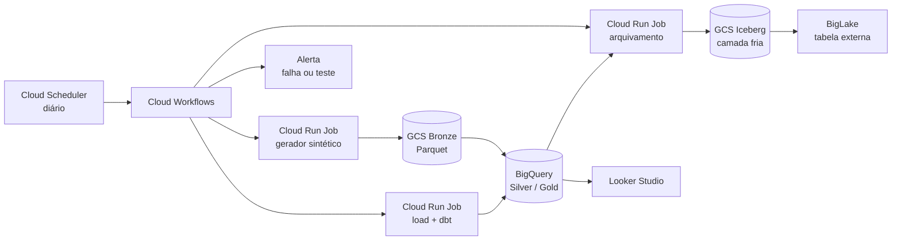

# Projeto GCP Free Tier — Telemetria sintética com FinOps, Qualidade e Iceberg

Sep 24, 2026 · @Henrique

## Visão geral

Pipeline diário de telemetria de dispositivos vestíveis **sintéticos** no GCP, 100% dentro do free tier, com arquitetura medalhão (Bronze → Silver → Gold) e uma camada fria em Apache Iceberg. O foco não é só mover dados: o projeto é a vitrine de **custo (FinOps)** e **qualidade de dados**.

O que o projeto demonstra:

- **FinOps:** decisão de armazenamento quente vs. frio baseada em números medidos (bytes processados, custo por classe de storage), documentada no README.
- **Qualidade e observabilidade:** testes automáticos, erros injetados de propósito pelo gerador e alertas quando algo falha.
- **Formato de tabela aberta:** camada fria em Iceberg via BigLake, com time travel e evolução de schema.
- **Infra como código e CI/CD:** tudo provisionado com Terraform e deploy via GitHub Actions.

Restrições do projeto:

- Custo alvo: **US$ 0/mês**, com alerta de orçamento em US$ 1.
- Nenhum dado real ou sensível: usuários, dispositivos e leituras são gerados por código com seed fixa.
- Sem Cloud Composer, Dataflow ou Dataproc (cobram mesmo parados).

## Arquitetura

O Cloud Scheduler dispara um Cloud Workflows por dia, que encadeia geração, ingestão, transformação, testes e arquivamento.



| Componente | Serviço GCP | Papel | Cota gratuita usada |
| --- | --- | --- | --- |
| Agendamento | Cloud Scheduler | Dispara o pipeline 1x/dia | 3 jobs grátis |
| Orquestração | Cloud Workflows | Encadeia passos, retries e alerta | Milhares de passos/mês |
| Processamento | Cloud Run Jobs | Gerador, load, dbt, arquivamento | Cota mensal de vCPU/memória |
| Data lake | Cloud Storage | Bronze em Parquet e camada fria Iceberg | 5 GB em região dos EUA |
| Warehouse | BigQuery | Silver e Gold (dados quentes) | 10 GB storage, 1 TB consulta/mês |
| Camada fria | BigLake + Iceberg | Consulta de dados antigos no GCS | Paga só a consulta (dentro de 1 TB) |
| Transformação | dbt Core (BigQuery adapter) | Modelos e testes | Open source |
| Dashboard | Looker Studio | Painéis de negócio, custo e qualidade | Grátis |
| Infra | Terraform + GitHub Actions | Provisionamento e CI/CD | Grátis |

Região padrão: **us-central1** (free tier do GCS vale só para regiões dos EUA). As cotas mudam com o tempo; conferir a página de free tier do Google antes de começar.

## Modelo de dados

O gerador cria três entidades de cadastro e uma série temporal de leituras, com volume pequeno o bastante para caber no free tier e grande o bastante para as métricas de custo fazerem sentido.

**Entidades sintéticas (geradas com Faker + seed fixa):**

| Entidade | Campos principais | Volume sugerido |
| --- | --- | --- |
| users | user\_id, faixa\_etaria, cidade, data\_cadastro | 200 |
| devices | device\_id, user\_id, modelo, firmware, ativado\_em | \~250 (alguns usuários com 2) |
| sessions | session\_id, device\_id, tipo (sono, treino, dia), inicio, fim | \~3/dispositivo/dia |
| readings | device\_id, ts, heart\_rate, steps, spo2, battery | 1 leitura a cada 5 min por dispositivo (\~72 mil/dia, \~26 milhões/ano) |

Nenhum campo identifica pessoa real: sem nome, e-mail ou documento.

**Camadas:**

| Camada | Onde fica | Formato | Conteúdo |
| --- | --- | --- | --- |
| Bronze | GCS `bronze/<entidade>/dt=YYYY-MM-DD/` | Parquet | Dado cru do gerador, append-only, com erros injetados |
| Silver | BigQuery `silver` | Tabela particionada por dia, clusterizada por device\_id | Deduplicado, tipado, leituras inválidas separadas em `silver.quarantine` |
| Gold | BigQuery `gold` | Tabelas agregadas | Métricas diárias por usuário, uso de dispositivos, bateria, qualidade |
| Fria | GCS `cold/` via BigLake | Apache Iceberg | Silver com mais de 90 dias, movida pelo job de arquivamento |

**Tabelas Gold sugeridas:**

- `gold.daily_user_metrics`: passos, FC média/min/máx e minutos de sono por usuário e dia.
- `gold.device_health`: bateria média, dias sem sinal e versão de firmware por dispositivo.
- `gold.data_quality_daily`: resultado de cada teste por dia (usado no painel de qualidade).
- `gold.cost_daily`: bytes processados e storage por camada (usado no painel de FinOps).

**Chaves de deduplicação:** `(device_id, ts)` para readings e `session_id` para sessions, com `MERGE` na Silver.

## Estrutura do repositório

Um único repositório com uma pasta por componente; cada job do Cloud Run tem seu próprio Dockerfile.

```
gcp-telemetry-finops/
├── README.md                  # visão geral, arquitetura, resultados de custo
├── CLAUDE.md                  # regras para o Claude Code (ver última seção)
├── Makefile                   # atalhos: make generate, make dbt, make deploy
├── .github/workflows/
│   ├── ci.yml                 # lint, testes Python, dbt compile, terraform plan
│   └── deploy.yml             # build das imagens + terraform apply (manual)
├── infra/                     # Terraform
│   ├── main.tf
│   ├── storage.tf             # buckets + lifecycle rules
│   ├── bigquery.tf            # datasets, conexão BigLake
│   ├── run_jobs.tf
│   ├── workflows.tf
│   ├── scheduler.tf
│   ├── budget.tf              # alerta de US$ 1
│   └── variables.tf
├── generator/                 # Cloud Run Job 1
│   ├── src/
│   │   ├── entities.py        # users, devices, sessions
│   │   ├── readings.py        # série temporal
│   │   ├── faults.py          # injeção de erros
│   │   └── main.py
│   ├── tests/
│   └── Dockerfile
├── loader/                    # Cloud Run Job 2: Bronze → Silver (MERGE) + dbt run/test
├── dbt/
│   ├── models/silver/
│   ├── models/gold/
│   ├── tests/
│   └── dbt_project.yml
├── archiver/                  # Cloud Run Job 3: Silver antiga → Iceberg
├── workflows/
│   └── daily_pipeline.yaml    # definição do Cloud Workflows
├── finops/
│   ├── queries/               # consultas de INFORMATION_SCHEMA
│   └── experiments.md         # resultados quente vs frio
└── docs/
    └── architecture.png
```

Desenvolvimento local em WSL2 com Docker Compose rodando o gerador e o dbt contra um projeto GCP de desenvolvimento.

## Fases de implementação

Sete fases, cada uma fechando com algo que funciona de ponta a ponta; só avance quando o critério de pronto estiver cumprido.

| Fase | Entrega | Critério de pronto |
| --- | --- | --- |
| 0. Fundação | Projeto GCP, conta de serviço, Terraform com buckets, datasets e alerta de orçamento | `terraform apply` sobe tudo do zero; alerta de US$ 1 ativo |
| 1. Gerador | Cloud Run Job gerando users, devices, sessions e readings em Parquet no Bronze | Um dia gerado com seed fixa é idêntico entre execuções; testes unitários passando |
| 2. Silver | Loader com `MERGE` no BigQuery, particionamento e clustering | Rodar o mesmo dia duas vezes não duplica linhas |
| 3. Gold + dbt | Modelos Gold e testes dbt | `dbt build` passa; painel de negócio no Looker Studio |
| 4. Orquestração | Cloud Workflows + Scheduler diário, com retry e alerta de falha | Pipeline roda 7 dias seguidos sem intervenção |
| 5. Qualidade | Injeção de erros, quarentena, `gold.data_quality_daily` e alertas | Cada tipo de erro injetado é detectado e aparece no painel |
| 6. Camada fria + FinOps | Archiver para Iceberg, tabela BigLake, experimentos de custo | README com tabela de custo quente vs frio medida, não estimada |

**Backfill:** depois da fase 4, gerar 12 meses de histórico de uma vez (com o gerador parametrizado por data) para ter dados antigos o suficiente para testar o arquivamento.

**Ordem de prioridade se o tempo apertar:** fases 0 a 4 formam o pipeline mínimo; 5 e 6 são o diferencial do portfólio e não devem ser cortadas, só simplificadas (ex.: Parquet em vez de Iceberg na camada fria).

## Qualidade de dados

O gerador injeta erros conhecidos numa taxa configurável (padrão 2% das linhas), e o pipeline precisa detectar cada um; é isso que prova que os testes funcionam.

| Erro injetado | Como o gerador cria | Onde é detectado | Ação |
| --- | --- | --- | --- |
| Leitura duplicada | Repete a mesma linha `(device_id, ts)` | `MERGE` na Silver + teste `unique` | Deduplica e conta no relatório |
| Valor fora da faixa | `heart_rate` negativo ou > 250, `spo2` > 100 | Teste dbt `accepted_range` | Linha vai para `silver.quarantine` |
| Campo nulo | `device_id` ou `ts` vazio | Teste `not_null` | Quarentena |
| Dispositivo órfão | `device_id` que não existe em devices | Teste `relationships` | Quarentena |
| Chegada atrasada | Leituras de 3 dias atrás no lote de hoje | Comparação `ts` vs data da partição | Reprocessa a partição afetada |
| Dispositivo sumido | Device ativo que para de enviar | Teste de freshness por device | Alerta de dispositivo sem sinal |
| Mudança de schema | Coluna nova (`skin_temp`) a partir de uma data | Comparação de schema no loader | Aceita coluna nullable e registra evento |

Cada execução grava uma linha por teste em `gold.data_quality_daily` (data, teste, linhas avaliadas, linhas com falha, status). Alerta: se um teste **bloqueante** falhar (nulos em chave, duplicatas acima de 5%), o Workflows interrompe a publicação da Gold e envia e-mail; testes de **aviso** só aparecem no painel.

Ferramentas: testes nativos do dbt mais `dbt-expectations` para faixas e distribuições. Nada de serviço pago de observabilidade.

## FinOps

O resultado final é uma tabela no README comparando custo e tempo de consulta entre as opções de armazenamento, com números medidos no próprio projeto.

**Fontes de medição:**

- `region-us.INFORMATION_SCHEMA.JOBS`: bytes processados, bytes cobrados e duração de cada consulta.
- `INFORMATION_SCHEMA.TABLE_STORAGE`: storage lógico vs físico por tabela.
- `gsutil du` / métricas do bucket: tamanho por prefixo e classe de storage.

Um job diário grava esses números em `gold.cost_daily`, alimentando o painel de custo.

**Experimentos a documentar em `finops/experiments.md`:**

| # | Experimento | Comparação | Métrica |
| --- | --- | --- | --- |
| 1 | Particionamento | Consulta de 7 dias em tabela sem partição vs particionada | Bytes processados |
| 2 | Clustering | Filtro por `device_id` com e sem cluster | Bytes processados |
| 3 | Quente vs frio | Mesma consulta de 1 mês na Silver vs Iceberg via BigLake | Bytes, tempo, custo estimado |
| 4 | Classe de storage | Custo mensal de 12 meses em Standard vs Nearline vs Coldline | US$/mês projetado |
| 5 | Modelo de cobrança | Storage lógico vs físico (compressed) no BigQuery | US$/mês projetado |
| 6 | Materialização | Gold como `table` vs `view` consultada 30x/mês | Bytes processados/mês |

**Regra de arquivamento a validar:** Silver com mais de 90 dias vai para Iceberg; lifecycle no bucket frio move para Nearline aos 30 dias e Coldline aos 90. O experimento 3 decide se 90 dias é o corte certo; ajuste com base no resultado e registre a decisão.

Como o volume é pequeno, o custo real vai ser próximo de zero. Mostre os valores **projetados para escala** (ex.: "com 10.000 dispositivos, o arquivamento economiza X por mês"), deixando claro que é projeção.

## Guardrails de custo e instruções para o Claude Code

Copie o bloco abaixo para o `CLAUDE.md` na raiz do repositório; ele mantém o Claude Code dentro do free tier e das decisões deste documento.

```markdown
# CLAUDE.md — gcp-telemetry-finops

## Contexto
Pipeline diário de telemetria sintética no GCP (free tier). Medalhão Bronze (GCS Parquet)
→ Silver/Gold (BigQuery) → camada fria Iceberg via BigLake. Foco: FinOps e qualidade de dados.

## Regras de custo (obrigatórias)
- NUNCA usar Cloud Composer, Dataflow, Dataproc, Cloud SQL ou VMs sempre ligadas.
- Região: us-central1 para tudo.
- Toda tabela BigQuery com partição por dia; readings clusterizada por device_id.
- Toda consulta com filtro de partição; nunca SELECT * em tabelas de leitura.
- Datasets com expiração padrão de partição em dev.
- Cloud Run Jobs com no máximo 1 vCPU e 512 MiB, salvo justificativa.
- Qualquer recurso novo entra via Terraform em infra/, nunca criado pelo console.

## Convenções
- Python 3.12, uv para dependências, ruff + pytest.
- Gerador determinístico: toda aleatoriedade passa por seed derivada de (seed_base, data).
- Loader idempotente: MERGE por chave; rodar o mesmo dia 2x não duplica.
- dbt: silver_* e gold_* como prefixos; todo modelo com testes em schema.yml.
- Configuração por variáveis de ambiente; nenhum segredo no código.

## Fluxo de trabalho
- Implementar uma fase por vez, seguindo a tabela de fases do documento de projeto.
- Ao fim de cada fase: testes passando, README atualizado, commit convencional (feat:, fix:, chore:).
- Antes de terraform apply, mostrar o plan e esperar confirmação.
```

**Checklist antes de começar:**

- [ ] Criar projeto GCP dedicado e vincular faturamento
- [ ] Criar alerta de orçamento de US$ 1 com e-mail
- [ ] Conferir as cotas atuais na página de free tier do Google
- [ ] Criar o repositório no GitHub com o `CLAUDE.md` acima
- [ ] Pedir ao Claude Code para começar pela Fase 0
